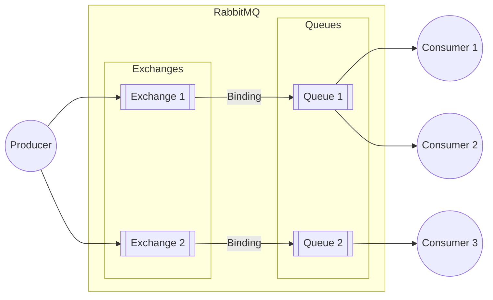

# Test Markdown

### Test Mermaid graph

```mermaid
flowchart LR;
p((Producer))
c1((Consumer 1))
c2((Consumer 2))
c3((Consumer 3))
ex1[[Exchange 1]]
ex2[[Exchange 2]]
q1[[Queue 1]]
q2[[Queue 2]]

subgraph Queues
    q1
    q2
end

subgraph Exchanges
    ex1
    ex2
end

subgraph RabbitMQ
    Queues
    Exchanges
end

p --> ex1
p --> ex2

ex1 -- Binding --> q1
ex2 -- Binding --> q2

q1 --> c1
q1 --> c2

q2 --> c3

```
